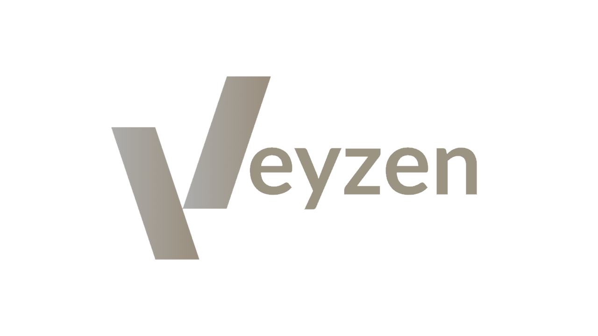

# Veyzen Client
Veyzen Client is an open source Minecraft PVP Client for 1.8.9 using the Forge API.


## Downloading
- Download the mod from the Releases section [here](https://github.com/VeyzenClient/Veyzen/releases)! *(Not released yet)*

## Screenshots

**Currently unavailable.**

## Building
1. Open a command proment or terminal and change the directory to the VeyzenClient's folder.
```
cd C:\User\Desktop\Veyzen
```
2. Make a build
```
gradlew build
```
You will find the new build in
```
C:\User\Desktop\Veyzen\build\libs
```
3. Copy the .jar file and paste it into your mods folder and launch forge for your version.

## Contributions
Feel free to fork this project, make changes and finally make a pull request to the development branch.

## License
This project is licensed under the GNU General Public License v3.0

Permissions:
- Modification 
- Distribution 
- Private use

Conditions:
- License and copyright notice
- State changes 
- Disclose source
- Same license 
